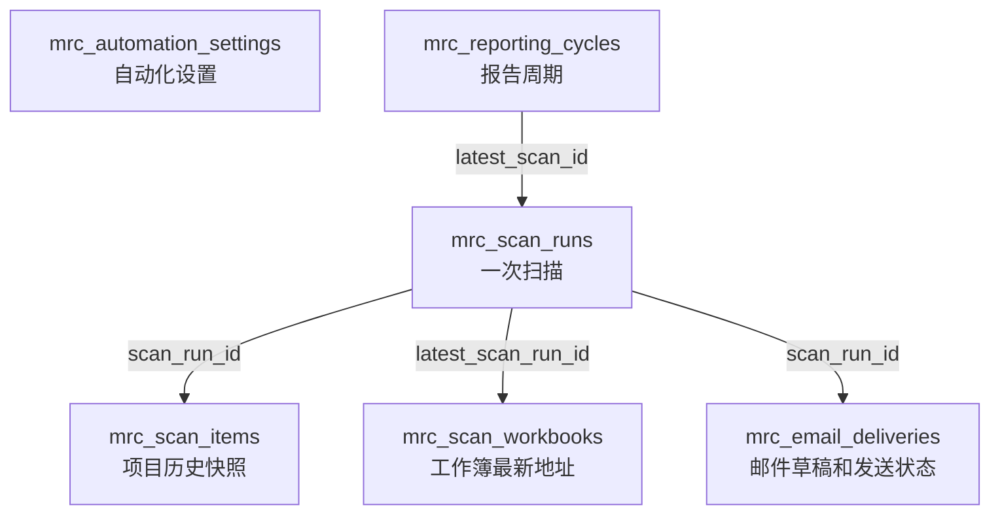

# MRC MySQL Table Relationships

```mermaid
flowchart TD
    Settings[mrc_automation_settings<br/>自动化设置]

    Cycle[mrc_reporting_cycles<br/>报告周期]
    Run[mrc_scan_runs<br/>一次扫描]
    Workbook[mrc_scan_workbooks<br/>工作簿最新地址]
    Item[mrc_scan_items<br/>项目历史快照]
    Email[mrc_email_deliveries<br/>邮件草稿和发送状态]

    Cycle -->|latest_scan_id| Run
    Run -->|scan_run_id| Item
    Run -->|latest_scan_run_id| Workbook
    Run -->|scan_run_id| Email
```
